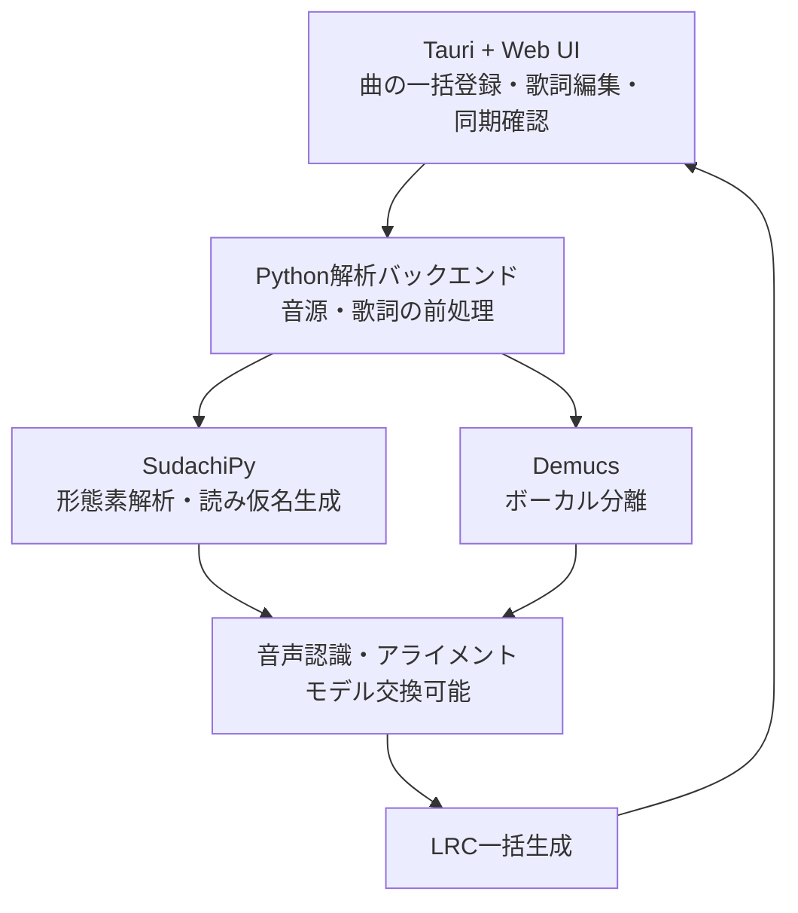

```mermaid
flowchart TD
    A["Tauri + Web UI<br/>曲の一括登録・歌詞編集・同期確認"]
    B["Python解析バックエンド<br/>音源・歌詞の前処理"]
    C["SudachiPy<br/>形態素解析・読み仮名生成"]
    D["Demucs<br/>ボーカル分離"]
    E["音声認識・アライメント<br/>モデル交換可能"]
    F["LRC一括生成"]

    A --> B
    B --> C
    B --> D
    C --> E
    D --> E
    E --> F
    F --> A
```